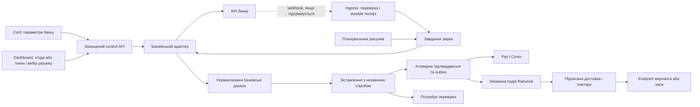

# План банківських конекторів у Conf та Corex

Дата: 2026-09-10. Статус: розширена пропозиція до погодження, не реалізація. Включає Dashboard onboarding і доставку подій мерчанту/касі.

## 1. Мета та межі

Розширити `/conf` до робочого місця параметрів банківських інтеграцій. `/corex` — єдине місце редагування й виконання процесів та перегляду їх технічної карти Workers/ендпоінтів. Dashboard — підключення власних рахунків мерчантом і керування його вихідними повідомленнями. У Conf показувати стан, версії та посилання на відповідні процеси, без вбудованого редактора чи другого рушія.

Перший фінансовий сценарій — підтвердження вхідних гривневих IBAN-переказів. Не включати вихідні платежі, split, payout, автоматичне повернення коштів, повний бухгалтерський ledger або автоматичний production deploy. Еквайрингове підтвердження — окремий тип конектора, не тотожний виписці рахунку.

Цей документ не дозволяє змінювати віддалені схеми, доступи, секрети, банківські налаштування, Workers чи маршрути. Кожне таке впровадження має окремий gate погодження. Наявні інваріанти Pay/Dashboard зберігаються.

## 2. Перевірена основа репозиторію

| Наявне | Використання / обмеження |
| --- | --- |
| [BankManager](../apps/conf/src/lib/components/BankManager.svelte), [BankConfiguratorModal](../apps/conf/src/lib/components/BankConfiguratorModal.svelte) | Основа вибору банку та налаштування deeplink/NBU; не керування банківськими credentials |
| [BankLinkStore](../apps/conf/src/lib/services/banklink-store.ts) | Прямий browser CRUD каталогу, fallback до кешу/defaults; немає потрібного release/CAS lifecycle |
| [BankTester](../apps/conf/src/lib/components/BankTester.svelte) | Генерація payload і ручна оцінка; не доказ оплати. Тестер отримує selectedBank, тоді як редактор має localBank: спочатку забезпечити тестування саме відкритої чернетки |
| [ProcessDiagram](../src/lib/features/corex/ProcessDiagram.svelte) | Початкове повторне використання діаграми та run overlay; спільний presentation layer без Dashboard singleton-залежностей |
| [ProcessDefinition](../src/lib/features/corex/process-definition.ts), [ProcessFlowDefinition](../src/lib/features/corex/process-flow-definition.ts) | Виконуваний процес і міжсистемна бізнес-схема — різні моделі |
| [ReleaseFlowCanvas](../src/lib/features/corex/ReleaseFlowCanvas.svelte) | Єдиний редактор; зараз залежить від Dashboard wiring, тому вбудовування потребує виділення спільного ядра |
| [Corex gateway](../src/lib/features/corex/corex-process-gateway.ts), [control plane](../worker/src/corex-control-plane.ts) | Чернетки з конфліктами ревізій, immutable версії, publish/start та run history; використати, але додати банківський scope/RBAC |
| [Process manifest generator](../scripts/generate-process-manifest.ts), [catalog](../src/lib/features/corex/deployed-process-catalog.ts) | Статична евристична інвентаризація, не live Cloudflare inventory; неповне покриття Conf/production/bindings |
| [Conf Worker](../worker/src/conf.ts) | Поточний `/conf/api/*` forward у API, не готовий proxy Corex або захищений bank control plane |
| [Checkout authority](../supabase/migrations/20260907222910_checkout_authority.sql), [settlement ledger](../supabase/migrations/20260908020000_checkout_settlement_ledger.sql) | Локальна основа незмінних спроб і атомарності, не готовий production bank adapter |

Фактичні remote deployments, RLS і зовнішній `rahunok` у межах цього планування не перевірялися. Старі mock-only описи Corex не замінюють перевірку поточного коду, а наявний код не доводить його розгортання.

## 3. Продуктова структура `/conf`

Ліворуч — пошук/список банків. У заголовку — банк, API-продукт, середовище, активний release, чернетка і стан спостереження. Глобальні налаштування банку та приватні підключення продавців відображаються з різними правами.

Вкладки:

1. **Огляд**: можливості, підтримувані власники/рахунки, погодження банку, здоров'я інтеграції, документація.
2. **Відкриття оплати**: наявні deeplink, QR/NBU, платформи; збереження сумісності.
3. **Підключення й рахунки**: бізнес-сутність, consent/access lifecycle, отримані від банку реквізити, дозволені рахунки; без розкриття секретів.
4. **Процеси**: read-only перелік прив'язаних процесів, активні версії, стан і перехід до Corex; редактор, граф та run overlay залишаються в Corex.
5. **Технічні зв'язки**: короткий read-only стан ресурсів і переходи до карти Workers/ендпоінтів у Corex; без незалежного редагування маршрутів.
6. **Тести та діагностика**: fixture suite, контрактні перевірки, ручний deeplink тест окремо від банківських доказів.
7. **Версії та зміни**: diff, вплив, перевірки, погодження, activation і rollback.

Пропонована нова навігація: зберігати bank/connector/environment/process/version у URL. «Відкрити у Corex» відкриває потрібний процес або карту ресурсів зі збереженим контекстом і перевіркою прав. Редактор у Conf не вбудовувати. Ці deep links ще не реалізовані.

## 4. Flow — не декоративна схема

### Три взаємопов'язані представлення

- **Бізнес-flow:** хто кому передає дані — користувач, Conf, захищений API, банк, Pay, Corex.
- **Процес:** точні виконувані кроки, умови, retries, очікування, помилки. Дескриптивна схема не перетворюється на executable без перевірки.
- **Розгортання:** де виконується кожен крок — Worker/service binding, route, Workflow, сховище, adapter build. Логічна межа не означає окремий Worker.

Визначення процесів і технічні зв'язки зберігаються як canonical versioned references; не копіювати граф Corex у незалежний JSON Conf. Layout/presentation metadata можна зберігати окремо. Пропоновані типізовані bank operation nodes потребують розширення compiler/runtime; вони не є вже наявними можливостями generic HTTP node.

### Процеси для кожного банку

| Процес | Призначення |
| --- | --- |
| Підключення платформи | Реєстрація/погодження Rahunok, якщо API цього потребує; для інших конекторів `not_required` |
| Підключення клієнта | Token або QR consent, підтвердження доступу, відмова/відкликання |
| Виявлення рахунків | Отримання рахунків, звірка власника, явний вибір доступних для Rahunok |
| Приймання повідомлень | Auth callback і transaction webhook як різні контракти; для polling-only не вигадувати webhook |
| Синхронізація виписки | Account-level polling, paging, overlapping windows, rate limiting і checkpoint |
| Зіставлення та підтвердження | Спільний захищений subprocess, показаний у кожному банку, але не скопійований |
| Відновлення й контроль доступу | Пропущені події, backfill, revoked credentials, сторно, manual review |
| Доставка мерчанту | Спільний процес outbox → підписане повідомлення → retry/DLQ, видимий із банківського flow; не повторює підтвердження оплати |

Приклад міжсистемної схеми; це план, не поточна deployed topology:

### Інспектор вузла

- Призначення, bank/connector/operation ID та власник виконання.
- Input/output schema, контракт і джерело документації.
- Для HTTP: напрямок, method/path, дозволений host або service binding, handler і auth strategy ID.
- Secret reference: лише безпечний alias/стан, ніколи значення.
- Timeout, retry/backoff, rate-limit scope, pagination/checkpoint policy, error branches.
- Adapter/process/config version, source reference, deployed build і час останнього спостереження.
- Sanitized fixture, результат тесту, trace/run/job reference; чутливі payload не показувати за замовчуванням.
- Режим редагування поля: конфігурація / потребує коду / лише читання.

### Правдиве відображення інфраструктури

Окремі позначки: `planned`, `source_defined`, `published`, `deployed_observed`, `unknown_or_stale`, `drift`.

Показувати desired та observed окремо, із source revision, environment і observation timestamp. Відсутність telemetry не означає відсутність Worker, а запис у Wrangler не означає live deployment. Publish процесу, deploy коду і реєстрація webhook у банку — три різні операції з окремими погодженнями.

## 5. Домени даних та версій

Це логічні сутності, не готова SQL-міграція:

| Сутність | Scope / ключова роль |
| --- | --- |
| Bank | Глобальна публічна банківська ідентичність, без credentials |
| ConnectorDefinition | Банк + API-продукт, capabilities, owner/account eligibility, підтримувані operation IDs |
| PlatformRegistration | Connector + environment, bank approval/system ID, захищене посилання на platform key |
| MerchantConnection | Tenant + business entity + connector + environment, consent/token state і credential reference |
| RecipientAccount | Банк-підтверджена ідентичність рахунку і власника, явний дозвіл використання |
| ContractVersion | Джерело/дата/hash документа, схеми, статуси, endpoint definitions, невирішені питання |
| BankFlowBinding | Посилання на business-flow/process/version та технічні resources, не копія графа |
| IntegrationRelease | Незмінний узгоджений комплект config + contract + adapter artifact + process versions + test evidence |
| Activation | Активний release на environment/контрольовану групу підключень, actor, revision, час |
| DeploymentObservation | Реальні спостереження Worker/version/routes/bindings із provenance і freshness |
| Evidence / SyncCheckpoint | Ідентичність банківської операції, історія змін, прогрес синхронізації; приватні серверні дані |
| MerchantWebhookEndpoint | Tenant + environment, перевірений HTTPS URL, підписки, account/entity scope, secret reference, revision і lifecycle |
| MerchantEvent / Outbox | Незмінна версійована подія, зв'язок із підтвердженням та замовленням, tenant/environment; створюється атомарно з фінансовим рішенням |
| WebhookDelivery / DeliveryAttempt | Окрема доставка на endpoint, стабільний event ID, версія призначення, спроби, наступний retry, результат, lease/fencing |

Тип власника `individual / sole_proprietor / legal_entity` — характеристика бізнес-сутності та eligibility, не обов'язково окремий адаптер. Один API для ФОП і ТОВ — один adapter; інший personal API того самого банку — інший connector.

Credentials ротуються незалежно від бізнес-версії; незмінна прив'язка спроби не повинна змушувати використовувати відкликаний секрет. При ротації зберігаються account identity та audit trail.

## 6. Межі швидких змін

| Зміна | Дозволений шлях |
| --- | --- |
| Інтервал polling, timeout/retry у межах capability, схвалений template, layout | Versioned config, validation/tests, review, activation |
| Зміна поля опису або структури response | Declarative typed mapping лише в обмеженій схемі, fixtures і review; невідомі поля/структури fail closed |
| Новий host, auth/signature, одиниці суми, трактування фінансового статусу, transaction identity, payment authority | Перевірений код/контракт адаптера, security review, tests, окремий deploy |
| Worker/binding/route або webhook registration | Окремий infrastructure/bank change plan, permissions, dry-run де доступний, explicit approval |

Не дозволяти довільний JavaScript, довільний authenticated fetch, вибір довільного секрету, редирект credentials на новий host або правило «будь-який status → paid» у графі. Загальний Corex HTTP action не замінює bank adapter. Egress allowlist, redirect handling і перевірка призначення credentials виконуються сервером.

### Lifecycle зміни

1. Додати нову документацію/контракт як нове джерело, не переписати чинне.
2. Показати semantic diff: endpoints, schemas, status/auth/rate-limit changes.
3. Через dependency graph показати вплив на adapter operations, процеси, Workers, підключення та активні спроби.
4. Створити draft release із CAS/revision контролем.
5. Прогнати static validation, fixtures, negative/security tests і локальні інтеграційні перевірки.
6. Preprod/shadow за окремим дозволом; shadow використовує збережені докази/спільний fetch, не подвоює безконтрольно банківські запити, не змінює оплати.
7. Review, immutable publish, deploy потрібного коду окремо, перевірка сумісності та explicit activation.
8. Контрольований пілот на визначених тестових підключеннях, моніторинг, подальше розширення.
9. Rollback active pointer лише на доступний сумісний artifact; зберегти історію. Rollback не скасовує банківський платіж і не видаляє доказів.

Фіксувати release/process/recipient/reference у нових спробах. Для активних спроб зберігати сумісний handler; звичайний redeploy Worker сам по собі не гарантує доступність старого adapter code. Потрібна явна стратегія multi-version dispatch або утримання старого deployment. Якщо банк вимкнув старий API, потрібна контрольована міграція обробника з незмінними фінансовими прив'язками або manual review, а не сліпий rollback.

## 7. Банківські профілі першої хвилі

### ПриватБанк Автоклієнт

- ФОП і юрособи з відповідним тарифом; personal accounts не вважати підтриманими.
- Token із банківським обмеженням лише читання балансів/транзакцій.
- Flow: credentials check → account discovery → settings/regulatory window → transactions/interim → усі pages → normalize → shared confirmation → final reconciliation.
- Для проведених надходжень враховувати `TRANTYPE=C`, `PR_PR=r`, рахунок, власника, суму/валюту й reference; `SUCCESS` відповіді не є paid.
- Ідентичність згідно документації — `REF` + `REFN`; зберігати структурованою парою у bank/environment/account scope, без неоднозначного склеювання рядків.
- Документ рекомендує не частіше 1 request/sec; точний scope ліміту уточнити, до того застосувати консервативний shared limiter. `followId` — pagination cursor, не доведений постійний incremental watermark.
- Webhook для цього каналу в дослідженому документі не описаний; UI показує polling.

### А-Банк аБізнес

- Platform registration → bank approval → client QR consent → authenticated account discovery → selected account.
- Production/preprod розділені. Ed25519, timestamp та точні body bytes — відповідальність adapter code.
- Callback `APPROVED` не є підтвердженням платежу; прив'язувати до pending consent і підтверджувати доступ автентифікованим API.
- Transaction webhook без встановленої перевірки автентичності — лише rate-limited/coalesced hint для statement reread; не джерело paid і не довірений tenant selector.
- Перед activation закрити питання status enum, webhook auth/schema, pagination/timezone/limits, стабільності IDs, ФОП eligibility, scopes токена. Уточнити суперечність Ed25519/SHA1withRSA та неповні base URL у прикладах.

### Monobank

- Окремі профілі Personal / approved Provider / Acquiring, не один універсальний mono token.
- Для централізованого доступу — погоджений provider flow; Personal API не обходить його.
- Acquiring має invoice identity та signed callback/status recovery, тому окрему нормалізацію доказів; не зіставляти еквайрингову виплату на рахунок як другу оплату того самого замовлення.

## 8. Фінансові та операційні інваріанти

- Конектор визначається рахунком отримувача; банк застосунку платника може бути іншим.
- Сервер фіксує tenant/entity/environment/account/connection/release/amount/currency/order reference у спробі; browser і graph не можуть їх підмінити.
- Суми нормалізуються без floating-point втрат; час проведення, час зміни і час отримання — різні поля.
- Одна банківська операція не підтверджує два замовлення навіть після ротації/перепідключення credentials. Зберігати account-scoped identity й контроль унікальності/конкурентності.
- Duplicate delivery і новий стан тієї самої операції — різні випадки. Сторно/повернення після paid створює новий доказ та інцидент, не стирає історію і не запускає автоматичне повернення.
- Неточний reference, недоплата/переплата, неоднозначність, невідомий статус або конфлікт → manual review. Ручне рішення має окрему природу й audit actor.
- Durable receipt/job перед успішним acknowledgment; обмежений ingress, recovery/retries, dead-letter/manual replay. Replay не обходить idempotency і не означає повторну оплату.
- Account-level single-flight із lease/fencing, повна пагінація і durable checkpoint після збереження відповідних даних. Не запускати bank polling на кожне відкрите замовлення/вкладку.
- Атомарні evidence/confirmation/outbox; Pay/Corex читають серверний результат. User-authenticated Corex signal не є bank-authenticated доказом.
- Test hostname не доводить isolation: credentials, DB rows/claims, events, Workflow bindings і storage namespaces потребують environment scope. Жодного production fallback.
- RBAC: viewer, integration editor, approver/operator з серверними scope checks; за потреби заборона self-approval production release. Merchant бачить лише власні підключення.
- Дані банку мінімізувати, обмежити retention, шифрувати чутливі записи, редагувати logs/traces. Не копіювати повні виписки у workflow outputs.

## 9. Етапи реалізації та критерії приймання

| Етап | Результат | Критерій готовності |
| --- | --- | --- |
| P0. Контракти та межі | Узгоджені сутності, RBAC, environment isolation, bank capability matrix, unresolved bank questions | Відомо, які поля можна конфігурувати, що є доказом і хто має право активувати |
| P1. Read-only Bank Flow | У Conf параметри й посилання; у Corex bank/process/resource associations, diagram та inspector | Для кожного пілотного банку видно шлях даних, Workers/endpoints та provenance; відкриття сторінки не виконує mutation/bank calls |
| P2. Версійні налаштування | Draft/CAS, shared draft tester, diff, immutable releases, audit, explicit activation | Тестер перевіряє саме draft; stale save відхилений; rollback перевірений; browser не має секретів чи широких прав |
| P3. Типізовані bank operations | Server adapter contract, protected credential resolution, compiler/runtime integration, account scheduler/inbox | Локальні fixture/negative/concurrency tests; generic HTTP не може отримати bank secret; без remote rollout |
| P4. Перший банк end-to-end | Приват за наявності доступу; Dashboard onboarding, підтвердження та merchant delivery за розділами 12–15 | Санкціонований test/preprod шлях Dashboard → доказ → paid → доставка касі; дублікат не видає товар повторно, недоступність каси не відкочує paid |
| P5. Керовані оновлення | Contract diff, impact analysis, shadow, controlled activation, rollback, run/trace overlay | Зміна банку відтворена у тесті; видно зачеплені ресурси; активні спроби не переприв'язані; observation/drift правдиві |
| P6. Другий адаптер | А-Банк/mono за готовністю, той самий контракт подій мерчанту, процеси лише в Corex | Новий банк доданий без дублювання confirmation/delivery engine; ізоляція й release suite проходять повторно |

P1 не залежить від реальних credentials і дає перший видимий результат. P2–P4 не обходять P0 security gate. Не оцінювати строки банківського погодження як гарантований engineering термін.

## 10. Тести та release gate

- UI: bank/environment switching, URL selection, linked nodes, draft/published/cached states, no mutation from viewer, unsaved-draft testing, права ролей.
- Contract: status/schema drift, exact decimal units, encoding, timezone, malformed response, missing reference, pagination completeness.
- Security: forged/replayed callback, wrong owner/account/environment, revoked token, forbidden host/redirect, secret redaction, cross-tenant reads/writes.
- Concurrency/recovery: webhook + polling race, два scheduler workers, crash до/після receipt/checkpoint/confirmation, reconnection duplicate, reordered updates, outbox retries.
- Financial: одна сума для двох замовлень, змінене призначення, late discovery, duplicate payment, partial/overpayment, reversal after paid, historical transaction reuse.
- Versioning: draft conflicts, incompatible adapter activation, old run after new release, retained artifact rollback, банк вимкнув старий endpoint.
- Local simulator позначається synthetic; Corex sandbox із синтетичним HTTP success не є сертифікацією банківської інтеграції.
- Перед будь-яким дозволеним deploy — відповідні build/tests/dry-run та scoped smoke згідно [project instructions](../.github/copilot-instructions.md). Conf assets залишаються окремими; суміжні маршрути не змінювати неявно.

Метрики: last successful account sync, ingestion lag, pages/backlog, retry/revocation/signature errors, unmatched/review count, confirmation latency, dead-letter count, active release, stale deployment observations. Відсутність webhook не дорівнює відсутності надходжень.

## 11. Джерела та наступний крок

- Інструкція аБізнес Open API, надана користувачем: прочитана повністю; питання контракту наведені вище. Не завантажувати приватний документ стороннім сервісам автоматично.
- [Офіційний API сайт ПриватБанку](https://api.privatbank.ua/) → [Автоклієнт 3.0.0](https://docs.google.com/document/d/e/2PACX-1vTtKvGa3P4E-lDqLg3bHRF6Wi9S7GIjSMFEFxII5qQZBGxuTXs25hQNiUU1hMZQhOyx6BNvIZ1bVKSr/pub).
- [Monobank Provider](https://api.monobank.ua/docs/corporate.html), [Acquiring](https://api.monobank.ua/docs/acquiring.html).
- [Corex master plan](COREX_MASTER_PLAN.md), [editor blueprint](COREX_WORKFLOW_EDITOR.md), [migration constraints](MIGRATION_PLAN.md). Історичні blueprint readiness твердження перевіряти за поточним кодом та окремо за live evidence.

Рекомендований наступний погоджуваний інкремент: **P0 + P1 локально** — профілі трьох банків, read-only Flow, інспектор Workers/ендпоінтів та переходи до Corex, без банківських запитів, секретів, міграцій чи deploy.

## 12. Dashboard: простий шлях мерчанта

Нижче — цільовий UX і контракти до реалізації, не підтвердження наявності цих можливостей. Принципи: поступове розкриття технічних деталей, мінімальні права, явна активація, окремі статуси грошей і доставки. Це архітектурна рекомендація, не аудит чи схвалення Stripe.

### 12.1. «Налаштування → Банківські підключення»

Основна кнопка **«Підключити банк»** запускає майстер:

1. **Бізнес і банк.** Вибрати власну бізнес-сутність, банк і підтримуваний продукт. Показати eligibility, тарифні умови й доступність; не пропонувати непідтверджений personal account сценарій.
2. **Надати доступ.** А-Банк: QR-згода з очікуванням і скасуванням. Приват: коротка інструкція створення read-only токена та захищене поле введення. Не запитувати пароль банкінгу, КЕП чи право вихідних платежів. Передавання токена лише захищеному backend, без localStorage, аналітики, логів і workflow payload. Відобразити обсяг даних і порядок відкликання згоди.
3. **Вибрати рахунки.** Отримати їх із банку, зіставити власника з бізнес-сутністю, показати валюту й масковані реквізити. Явно вибрати рахунки для підтвердження. Ручний IBAN або успішне читання чужого доступного рахунку не обходить ownership check.
4. **Перевірити підключення.** Показати результат читання, час синхронізації та невирішені обмеження. «Доступ працює» не називати «тестова оплата пройшла». Synthetic перевірку й санкціоновану реальну оплату позначати окремо.
5. **Активувати підтвердження.** Підсумок рахунків, правила точного призначення/суми, поведінка спірних оплат. Активація доступна лише після server-side readiness gate. Історична виписка не підтверджує нові рахунки автоматично.
6. **Необов'язково: повідомляти касу.** Перехід до окремого майстра webhook; його можна пропустити. Відсутність endpoint не блокує оплату в Rahunok.

Картка підключення: `очікує згоди / перевіряється / активне / затримка синхронізації / доступ відкликано / призупинене`, обрані рахунки, остання синхронізація, дії «Перепідключити», «Змінити рахунки», «Призупинити». Health, consent і activation — окремі внутрішні стани, не один boolean. Заміна реквізитів діє лише на нові спроби; чинні отримувачі незмінні. За відкликаного доступу немає автоматичного paid чи fallback на інший банк; показати затримку/ручну перевірку.

Підключення можуть керувати лише уповноважені ролі власного tenant. Системні platform keys/банківське погодження належать адміністративному Conf, не merchant UI. QR callback прив'язаний до конкретного pending consent, tenant і середовища; довільний callback не активує підключення.

### 12.2. «Інтеграції → Webhook»

Майстер: **HTTPS endpoint → події та scope → signing secret → тест → увімкнути**.

- За замовчуванням підписка тільки на `payment.confirmed`. Рахунки/бізнес-сутності обираються в межах прав мерчанта; нові підключення не розширюють scope непомітно.
- Secret показати один раз, далі лише ротація/стан; банківський токен не використовується як signing secret.
- Тест перевіряє контроль endpoint і протокол доставки, але не доводить коректної видачі товару. Подія `webhook.test` явно тестова, без зміни статусу рахунку.
- Статуси: не перевірений, активний, призупинений, помилки доставки. Показати останню доставку та дію «Переглянути журнал».
- Для каси без доступного публічного HTTPS endpoint — автентифіковане опитування merchant API через її backend/захищений агент. Не відправляти webhook на localhost чи приватну адресу і не вкладати довготривалий merchant secret у публічний браузер каси.

### 12.3. Картка рахунку

Два незалежні блоки:

- **Оплата:** очікується / оплачено / потребує перевірки; джерело й час підтвердження, сума/валюта, безпечний reference доказу.
- **Повідомлення мерчанту:** не налаштовано / у черзі / доставлено / повтор через … / вичерпано спроби / призупинено. Доставка відображається окремо для кожного endpoint.

Timeline: спроба створена → банк повідомив/виписку прочитано → доказ перевірено → рахунок оплачено → подія створена → спроби доставки. «Повторити доставку» не викликає нове фінансове підтвердження. Стан «доставлено» означає HTTP acknowledgment, не фізичну видачу товару.

## 13. Контракт подій Rahunok і гарантії доставки

### 13.1. Не прозоре пересилання webhook банку

Основна інтеграція каси — стабільна подія Rahunok `payment.confirmed`, незалежна від банку та способу отримання доказу. Виписка може не мати вихідного банківського webhook взагалі. Не пересилати банківські auth headers, tokens, повну виписку або неперевірений payload.

За обґрунтованої потреби окремо спроєктувати opt-in подію `bank.transaction.observed`: мінімізований дозволений набір полів, provenance/verification state, account scope і власна схема. Вона не є командою видати товар і не замінює `payment.confirmed`. Це не побайтовий proxy та не частина першого MVP; будь-яке розкриття оригіналу потребує окремого privacy/security review.

### 13.2. Мінімальний envelope v1

| Поле | Призначення |
| --- | --- |
| `id`, `type`, `schema_version` | Стабільний event ID, тип події, версія схеми |
| `created_at`, `environment` | Час створення події та явне test/live середовище |
| `merchant_id`, `business_entity_id` | Авторизований власник; не довіряти цим полям без перевірки підпису й локального scope |
| `data.invoice_id`, `data.payment_attempt_id`, `data.confirmation_id` | Стабільний зв'язок із рахунком, спробою та доказом рішення |
| `data.merchant_reference` | Зовнішнє замовлення/сесія каси, зафіксовані сервером під час створення рахунку |
| `data.amount_minor`, `data.currency`, `data.status` | Точна сума у мінімальних одиницях, валюта, підтверджений стан |
| `data.confirmed_at`, `data.confirmation_source` | Час рішення, bank/manual походження, якщо ручний режим дозволений окремою політикою |
| `data.resource_version` | Монотонна версія платіжного ресурсу для виявлення застарілих подій |

Назви є пропозицією контракту; перед реалізацією узгодити `invoice_id` з фактичною моделлю order/checkout, не створювати дубль фінансового ресурсу. Повні реквізити платника не включати за замовчуванням. Банківський reference не підміняє `merchant_reference`.

Після створення event payload незмінний. Retry/replay зберігає event ID і schema version; кожна спроба доставки має власний attempt ID. Новий фінансовий факт (наприклад сторно) створює іншу подію, а не редагує стару. Автоматичний і ручний спосіб підтвердження мають бути розрізнювані; synthetic ніколи не створює live `payment.confirmed`.

### 13.3. Транзакційна межа

1. Автентифікувати банківське джерело або перечитати дані через довірений API.
2. Зберегти доказ і виконати точне зіставлення з незмінною спробою, перевіривши tenant/environment/account/reference/amount/currency та унікальність операції.
3. **В одній транзакції БД:** фінансове рішення + стан рахунку + незмінна подія + durable outbox. Унікальність події прив'язана до конкретного переходу/confirmation, а не випадкового ID нового запуску.
4. Незалежний delivery worker створює/обробляє доставки для дозволених підписок; fan-out і retries ідемпотентні за event + endpoint. Фіксувати історію subscription/endpoint revision, щоб зміна URL не перенаправила старий backlog непомітно.
5. Pay читає авторитетний стан. Corex спостерігає/оркеструє доставку, але втрата його сигналу не губить outbox.

HTTP-запит мерчанту не виконувати всередині фінансової транзакції. Недоступна каса не відкочує paid. Гарантія доставки — **at least once**, не exactly once; порядок подій не гарантований. Після 2xx доставка підтверджена транспортно, не виконана фізично.

### 13.4. Підпис та безпека endpoint

- HTTPS, перевірка сертифіката, дозволені порти/призначення. Серверна SSRF-перевірка під час створення і кожної доставки: заборона loopback/private/link-local/metadata та IPv6-еквівалентів, захист від DNS rebinding. Не слідувати HTTP redirects. Якщо runtime не гарантує безпечне з'єднання з перевіреною адресою — потрібен контрольований egress transport, а не лише попередній DNS lookup.
- Запропонований протокол: `Rahunok-Signature` з `t`, `kid`, `v1`; HMAC-SHA256 від `timestamp + "." + exact raw body bytes`, окремим секретом endpoint/environment. Опублікувати точне кодування та тестові вектори до SDK/реалізації.
- Одержувач перевіряє підпис constant-time, допустиме відхилення часу (початкова пропозиція — 5 хвилин), environment і scope. Підпис перевіряється до JSON-перетворень, за сирими байтами. Retry має новий timestamp/signature, але той самий event ID.
- Ротація з обмеженим періодом перекриття ключів та `kid`; не повертати відкликаний ключ заради replay. Зміна endpoint вимагає повторної перевірки, revision і явного рішення щодо backlog.
- Обмеження розміру body/response, timeout, tenant quotas, аудит змін. У журналах — redacted URL без credentials/query secrets, коротка очищена відповідь без чутливих даних. Не дозволяти довільні auth headers чи secrets через generic Corex HTTP action.

### 13.5. Retry і відновлення

Початкова політика до узгодження: перша спроба одразу, повтори приблизно через 1 хв, 5 хв, 30 хв, 2 год, 6 год, 12 год, далі до загального вікна 72 год; exponential/backoff із jitter, bounded `Retry-After` для 429/503. Це параметри Rahunok, не банківські ліміти чи гарантований SLA.

2xx — acknowledgment; timeout/network/408/429/5xx — retry; 3xx не переходити, помилки конфігурації/401/403/404 позначати й сповіщати з обмеженим повторенням; 410 — призупинити endpoint. Після вичерпання бюджету — failed/DLQ, сповіщення та ручний replay з аудитом. Replay перевіряє поточні права, scope, endpoint revision та ліміти; не створює новий event і не обходить dedupe.

Призупинення endpoint не змінює оплати. Політика retention та відновлення backlog має бути явною; після закінчення строку зберігання запропонувати merchant status API, а не обіцяти нескінченний replay. Статус цього API захищений tenant/environment authorization та містить resource version; він потрібний і для відновлення після пропущених подій.

### 13.6. Обов'язки каси

Каса перевіряє підпис → звіряє власне замовлення/сесію, суму й валюту → атомарно зберігає event ID та завдання виконання → швидко відповідає 2xx → виконує завдання. Дублікат повертає 2xx без повторного виконання. Для фізичного пристрою потрібні окремі idempotency/acknowledgment і відновлення невизначеного стану після crash; dedupe webhook сам по собі не гарантує одноразову фізичну видачу.

Якщо сесію каси закрито, замовлення скасовано або ресурс має новішу версію — не видавати товар сліпо, звірити merchant API/перевести в exception flow. Пізня оплата та сторно після видачі потребують окремого бізнес-рішення; автоматичне повернення коштів поза MVP.

## 14. Послідовність змін інтерфейсу й запуску

Ці кроки деталізують P0–P6, а не замінюють їх security/deployment gates.

| Крок | Інтерфейс / backend результат | Gate |
| --- | --- | --- |
| 1. Узгодити контракт | Межі Conf/Corex/Dashboard, payment event v1, зовнішній reference каси, roles, retention, error states | Визначені власник рахунку, джерело paid, правила fulfillment та підпис webhook |
| 2. Локальний UX | Conf з параметрами/посиланнями; Corex карта; Dashboard майстри й подвійний статус рахунку на явно synthetic даних | Немає секретів, банківських викликів і прихованих mutations |
| 3. Захищене підключення | Consent/token backend, tenant-scoped account binding, credential storage/rotation, read-only adapter | Ownership/RBAC/revocation та test/live isolation пройдені; schema migrations окремо погоджені |
| 4. Локальна фінансова вертикаль | Evidence → matching → confirmation/event/outbox; status API | Crash/concurrency/deduplication tests, жодного paid за неперевіреним callback |
| 5. Локальна доставка | Endpoint settings, signer, retries, журнал, replay, mock каса з durable inbox | Підпис, SSRF, дублікат, downtime, replay/rotation тести; товар не видається за `webhook.test` |
| 6. Санкціонований bank shadow | Один мерчант/рахунок; порівняння доказів з очікуваннями, без автоматичного paid та live fulfillment | Задокументовані статуси, latency, призначення, completeness; немає зайвого подвоєння запитів |
| 7. Контрольований live пілот | Окреме погодження deployment і активації; один мерчант, рахунок, endpoint; санкціонована мала реальна оплата | Dashboard/Pay paid та каса отримує правильну подію; повтор не виконує дію вдруге; відключена каса не блокує paid |
| 8. Розширення | Спостереження, поступове додавання рахунків/банків, документація мерчанта й приклади перевірки підпису | Пройдені операційні критерії, відомі обмеження та готовий rollback/runbook |

Якщо банк не має підтвердженого sandbox, local simulator не називати sandbox банку; реальний read-only shadow і будь-який платіж потребують явного дозволу. Розділити перемикачі `ingestion`, `automatic_confirmation`, `merchant_delivery`: зупинка доставки не зупиняє підтвердження; зупинка автоматичного підтвердження зберігає докази для review. За відкликання consent припиняється доступ до банку незалежно від перемикачів.

## 15. Додаткові критерії приймання та операційна готовність

- Dashboard: повторне відкриття майстра, відхилена/відкликана згода, невірний токен, чужа бізнес-сутність, декілька рахунків, зміна реквізитів під час активної оплати; секрет не видно після збереження.
- Події: crash між confirmation/outbox і після send до acknowledgment; дубль webhook+polling; повторний fan-out; event не губиться і не створює друге фінансове рішення.
- Доставка: tampered raw body, прострочений підпис, test/live mismatch, ключі під час ротації, DNS rebinding/redirect/private IP, rate limit, timeout, 410, endpoint URL change із backlog, DLQ/replay, cross-tenant спроби.
- Каса: однаковий event двічі, два різні events для вже виконаного замовлення, закрита сесія, неправильні сума/валюта/reference, події не за порядком, crash під час видачі. Зберігати і event dedupe, і бізнес-ідемпотентність fulfillment.
- Спостережуваність: наскрізні confirmation/event/delivery/run IDs без секретів; bank sync lag, confirmation lag, oldest outbox age, delivery success/latency, retry/DLQ count, відкликані доступи. Цільові пороги визначити до пілота на основі можливостей банку, не обіцяти миттєвість polling.
- Runbooks: банк недоступний, токен відкликано, каса offline, несправний підпис, помилка match, пізня оплата, сторно, невизначена видача, rollback adapter. Призначити відповідальних і канал сповіщень.
- Rollback не видаляє оплати/події й не повертає гроші: зупиняє відповідну автоматизацію, зберігає backlog/evidence, перевіряє сумісність schema/adapter, відновлює з контрольованої точки.

Документ після доповнення є основою end-to-end планування. Готовність коду Dashboard, merchant API та delivery infrastructure необхідно окремо підтвердити перед реалізацією; описаний UX/контракт не є заявою про вже розгорнутий функціонал.