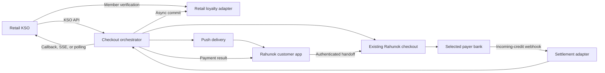

# KSO and Rahunok mobile implementation plan

## Goal

Enable any retail network to identify a customer at a self-checkout, apply network loyalty benefits, and offer the existing Rahunok Pay by Bank checkout as the preferred lower-cost payment method.

Retail-specific behavior is isolated behind KSO and loyalty adapters. Payment creation, bank selection, checkout, settlement reconciliation, and terminal payment states remain network-neutral.

The API contract is defined in `kso-mobile-openapi.yaml`.

## Supported scenarios

### 1. Guest checkout

1. The customer selects Rahunok Pay by Bank at the KSO.
2. The KSO creates a checkout request without a customer session.
3. Rahunok creates the existing checkout order and returns a `checkout_url`, QR payload, payment ID, and expiry.
4. The KSO displays the QR or assigns the checkout to the terminal's static NFC tag.
5. The customer completes the existing bank-selection and Pay by Bank flow.
6. Rahunok marks the payment `paid` only after reconciling a verified incoming-credit webhook.

### 2. Network loyalty member and first link

1. The KSO verifies the loyalty member through the network's existing mechanism.
2. The KSO creates a customer session with the network loyalty reference and proof from the network adapter.
3. The KSO obtains a network-authoritative loyalty quote and creates checkout with the final amount.
4. The customer pays through the existing checkout.
5. After settlement, Rahunok links the payment identity to the network loyalty member when the configured evidence policy is satisfied.
6. Ambiguous or conflicting evidence produces a reviewable link conflict and never blocks the paid order.

### 3. Recognized Rahunok customer and mobile payment request

1. The customer presents an opaque Rahunok Wallet or application token.
2. The KSO asks Rahunok to resolve it for the current network and terminal session.
3. Rahunok returns the network loyalty reference and a short-lived customer session token. It does not expose Rahunok customer ID, TIN, phone, or IBAN.
4. The KSO obtains loyalty benefits, builds the final basket, and creates checkout with `presentation_mode: mobile_push`.
5. Rahunok sends a push containing only the payment request ID.
6. The authenticated application loads the request, confirms the merchant and amount, and opens the existing checkout.
7. The customer chooses a bank and authorizes Pay by Bank.
8. A verified incoming-credit webhook produces `paid`; Rahunok notifies both the KSO and mobile application.

In this release, RTP means delivery of a personal payment request to the Rahunok application. It does not mean bank-side mandate execution or payment authorization inside Rahunok.

## Ownership boundaries

| Component           | Responsibility                                                                            |
| ------------------- | ----------------------------------------------------------------------------------------- |
| KSO                 | Basket, terminal UX, loyalty input, final amount, receipt                                 |
| Retail adapter      | Member verification, quote, commit, reversal                                              |
| KSO API             | Customer session, checkout orchestration, status delivery                                 |
| Existing checkout   | Bank list, bank selection, initiation, customer-facing payment UX                         |
| Settlement adapter  | Authenticate, normalize, deduplicate, and reconcile incoming-credit webhooks              |
| Mobile API          | Devices, payment inbox, authenticated checkout handoff, decline                           |
| Rahunok application | Identity QR/Wallet token, push handling, request review, checkout opening, result display |

## Architecture



## Data model

### New records

- `customers`: canonical internal customer identity.
- `customer_devices`: device installation, push token digest, platform, state, and last activity.
- `wallet_passes`: opaque token digest, customer, platform, state, and rotation timestamps.
- `loyalty_networks`: network configuration and adapter version.
- `network_customer_links`: customer-to-network member mapping, status, evidence, and audit timestamps.
- `customer_sessions`: network, KSO session, recognized subject, loyalty reference, expiry, and signed token digest.
- `loyalty_quotes`: authoritative quote, basket digest, final amount, network transaction reference, and expiry.
- `checkout_requests`: KSO session, existing order/payment IDs, presentation mode, amount, expiry, and state.
- `checkout_events`: append-only state transitions.
- `settlement_events`: provider event ID, normalized payload digest, reconciliation result, and processing state.
- `outbound_deliveries`: KSO callback and mobile push attempts with retry state.
- `identity_link_events`: append-only link, conflict, unlink, and review decisions.

### Required uniqueness

- `(network_id, kso_session_id)` for an active customer session.
- `(network_id, order_reference)` for checkout creation.
- `(provider_id, provider_event_id)` for incoming-credit webhooks.
- one successful payment per order.
- one active `(customer_id, network_id)` loyalty link unless the network explicitly supports multiple memberships.
- one loyalty commit per paid order.

## State machines

Checkout request:

```text
created -> presented -> opened -> bank_selected -> payment_initiated
        -> awaiting_settlement -> paid
        -> declined | expired | failed | cancelled
```

Loyalty processing is independent:

```text
not_applicable | pending -> committed
                         -> retrying -> committed | failed
```

Identity linking is independent:

```text
not_requested | pending -> linked
                        -> conflict | rejected
```

Only the settlement adapter may transition a checkout to `paid`. A browser redirect, mobile action, KSO callback, or push receipt cannot do so.

## API conventions

- KSO base path: `/api/v1/kso`.
- Mobile base path: `/api/v1/mobile`.
- Existing checkout paths remain unchanged.
- Amounts are integer minor units; UAH 428.00 is `42800`.
- Rahunok provisions each integration with `partner_id`, `key_id`, and a 256-bit secret. Secrets are separate for inbound KSO requests and outbound Rahunok callbacks.
- Every KSO request requires `X-Partner-ID`, `X-Rahunok-Key-ID`, `X-Rahunok-Timestamp`, `X-Rahunok-Nonce`, and `X-Rahunok-Signature`. Mutations additionally require `Idempotency-Key`.
- The signature is `v1=` plus the base64url HMAC-SHA256 of `METHOD + "\n" + PATH_AND_SORTED_QUERY + "\n" + TIMESTAMP + "\n" + NONCE + "\n" + IDEMPOTENCY_KEY + "\n" + SHA256_HEX(EXACT_BODY_BYTES)`.
- Rahunok rejects timestamps outside a five-minute window and any reused `(partner_id, key_id, nonce)` within that window. Signature comparison is constant-time.
- Key rotation supports two active key IDs for up to 24 hours. Secrets are never sent in API traffic or logs. Mutual TLS may be enabled for a partner but does not replace request signing.
- Every response carries `X-Correlation-ID`.
- Mobile calls use a short-lived bearer access token bound to an authenticated device session.
- Errors use one stable envelope with machine-readable `code`, user-safe `message`, `correlation_id`, and optional field errors.
- Retrying the same idempotency key with a different body returns `409 idempotency_conflict`.
- Unknown customers produce `recognized: false`; they are not API errors.
- KSO status webhooks are delivered at least once and are deduplicated by `event_id`.
- Callback endpoints are HTTPS URLs allowlisted in the partner profile, not URLs supplied per request. Each checkout may request `compact` or `full` payload mode within that profile.
- Callback signatures use a dedicated outbound secret and the same canonical algorithm with `X-Rahunok-Webhook-Key-ID`, timestamp, delivery ID, and exact body digest.
- The mobile identity token is opaque and revocable; rotation allows a short overlap only for already active KSO sessions.

## Bank status forwarding to KSO

The Worker does not proxy a bank webhook byte-for-byte. It performs this ordered pipeline:

1. Authenticate the bank/provider webhook and enforce timestamp and replay rules supported by that provider.
2. Persist the provider event ID and raw payload digest for audit and deduplication.
3. Normalize the event and reconcile payment reference, amount, currency, and beneficiary against the Rahunok checkout.
4. Commit the canonical payment transition. Only a successful reconciliation may produce `paid`.
5. In the same logical transaction, write an outbound KSO event to the durable outbox.
6. Deliver the signed callback to the partner's allowlisted endpoint and retry until acknowledged or moved to the dead-letter queue.

`compact` callbacks contain `event_id`, event type, timestamp, checkout request ID, KSO session ID, retailer order reference, and canonical payment status. `full` callbacks additionally contain amount, currency, payment time, loyalty/link states, and a normalized settlement reference. Neither mode contains the raw bank payload, payer name, TIN, IBAN, phone, bank access token, or Rahunok internal customer ID.

The KSO acknowledges with `200` or `204`. Other responses and network failures are retried with exponential backoff and jitter for 24 hours. Delivery is at least once; the KSO must persist and deduplicate `event_id`. Polling the checkout status remains the recovery path if callback delivery is delayed.

## Implementation phases

### Phase 0: contracts and test fixtures

- Freeze the KSO/mobile OpenAPI contract and generate request/response fixtures.
- Obtain the final A-Bank incoming-credit webhook payload, authentication, retry, ordering, and reconciliation fields.
- Define the first retail adapter's member-proof and quote semantics.
- Agree KSO latency budgets, callback delivery policy, and terminal fallback behavior.
- Complete threat modeling and data-retention review.

Exit criteria: contract review signed off by Rahunok, one KSO vendor, and one retail network; webhook samples replay in a local normalizer.

### Phase 1: persistence and core orchestration

- Add migrations for the new records and uniqueness constraints.
- Implement customer-session and checkout-request services.
- Wrap the existing order/checkout creation path instead of duplicating payment logic.
- Implement append-only events and transactional outbox delivery.
- Add settlement event normalization and idempotent reconciliation.

Exit criteria: all three scenarios work through service-level tests with simulated bank events.

### Phase 2: KSO API and simulator

- Implement KSO authentication, signing, rate limits, idempotency, and correlation IDs.
- Implement customer resolution, quote, checkout creation, NFC assignment, status polling, and cancellation.
- Implement signed KSO status callbacks with retries and dead-letter handling.
- Publish a sandbox, sample payloads, and a KSO simulator.

Exit criteria: vendor conformance tests pass for duplicate requests, stale signatures, expired sessions, reconnects, and guest fallback.

### Phase 3: mobile API and application

- Implement authenticated device registration and push-token rotation.
- Implement pending payment inbox, details, authenticated checkout handoff, decline, and status.
- Send only payment request IDs in push payloads; load amount and merchant after authentication.
- Deep-link into the existing checkout with a single-use, short-lived handoff token.
- Add foreground, background, expired, declined, and paid UX.

Exit criteria: a recognized customer receives and completes a request on iOS and Android; copied push links and revoked devices cannot load it.

### Phase 4: loyalty linking and pilot

- Implement the first retail loyalty adapter and asynchronous paid-order commit.
- Implement evidence policy, conflict quarantine, support review, unlinking, and audit history.
- Pilot guest, first-link, and returning-customer flows on selected terminals.
- Instrument identification latency, Pay by Bank offer rate, conversion, settlement latency, callback delivery, and loyalty failures.

Exit criteria: no loyalty outage blocks checkout or receipt; payment and loyalty can be reconciled independently.

### Phase 5: scale-out

- Add ATB, VARUS, and subsequent networks as adapters without changing the public checkout contract.
- Add per-network feature flags, staged rollout, provider routing, dashboards, and SLO alerts.
- Add reconciliation reports for unmatched and duplicated incoming credits.
- Evaluate richer bank capabilities separately from the baseline checkout flow.

## Test strategy

- Contract tests validate every OpenAPI request, response, and error fixture.
- State-machine tests reject illegal transitions and duplicate terminal effects.
- Adapter tests cover member not found, changed basket, expired quote, timeout, retry, and reversal.
- Settlement tests cover duplicate, delayed, out-of-order, malformed, unmatched, underpaid, and overpaid webhooks.
- Mobile tests cover revoked devices, replayed handoff tokens, expired requests, and concurrent acceptance.
- End-to-end tests cover all three scenarios with the existing checkout and a simulated incoming-credit webhook.
- Load tests target customer-resolution and checkout-creation latency independently.

## Pilot SLOs and metrics

- Customer resolution API: p95 at most 300 ms excluding the retail network's measured adapter time.
- Checkout creation API: p95 at most 500 ms excluding existing checkout dependencies.
- KSO status notification after reconciled settlement: p95 at most 1 second.
- Duplicate settlement events causing duplicate payment or loyalty effects: zero.
- Guest checkout remains available whenever customer identification or loyalty is unavailable.
- Report Pay by Bank offer rate, open rate, authorization conversion, paid conversion, and median settlement latency.

## External inputs required before implementation freeze

1. Final A-Bank webhook schema and the fields used to reconcile an incoming credit to `payment_id`.
2. Which evidence is sufficient to create the first customer-to-loyalty link automatically.
3. Mobile authentication provider and whether iOS and Android are delivered from one cross-platform codebase.

KSO authentication, callback signing, full/compact payload modes, callback-first delivery, and polling fallback are Rahunok protocol decisions defined above rather than partner-selected open questions.
