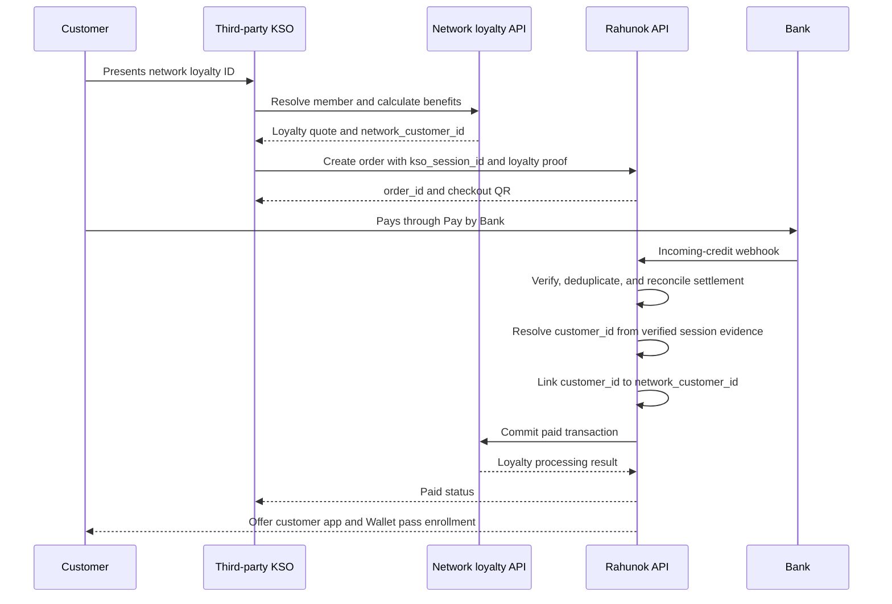
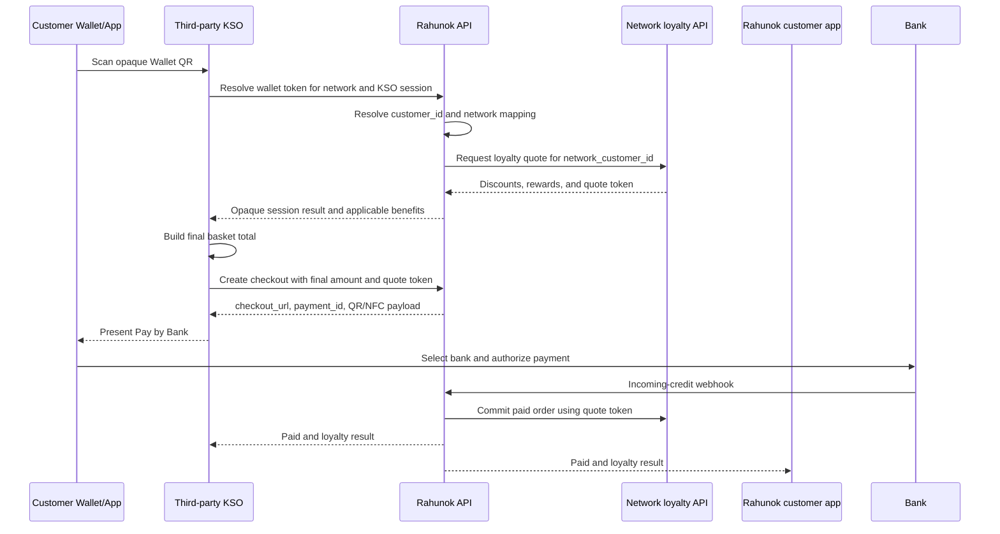

# KSO customer identification and Pay by Bank integration

## Decision summary

- `/app` remains the merchant POS application.
- A separate native Rahunok customer application will be built with React Native or Flutter.
- Rahunok owns the canonical customer identifier and payment identity matching.
- Each retail network remains the source of truth for loyalty balances, tiers, rewards, accrual, and redemption.
- Rahunok stores a network-scoped mapping between its customer identifier and the network's loyalty identifier.
- Apple Wallet and Google Wallet passes expose a static opaque Rahunok token. They never contain a TIN, IBAN, phone number, or a network loyalty identifier.
- The universal KSO flow is: identify the customer, apply network-authoritative loyalty benefits, create the existing Rahunok checkout, and present Pay by Bank as the preferred lower-cost payment method.
- Rahunok initiates payment through its existing checkout mechanisms. A-Bank supplies incoming-credit webhooks used to confirm settlement; it is not the source of checkout initiation.
- ATB, VARUS, and other retail networks differ only through KSO and loyalty adapters. The payment orchestration and checkout contract remain network-neutral.
- A first successful purchase may link the Rahunok customer to the loyalty member when both identities are independently verified and belong to the same KSO checkout session.
- Third-party KSO/POS vendors integrate through REST APIs and a QR scanner.

## Trust boundaries

The Wallet barcode is an identifier, not an authentication factor. Anyone who copies it could present it at a KSO. Scanning the barcode may therefore retrieve loyalty context and prepare an RTP request, but it must not authorize payment, expose personal data, or irreversibly spend rewards by itself.

Payment authorization happens in the existing Rahunok checkout and the selected bank. A verified incoming-credit event from the settlement bank remains the authority for the final `paid` transition. Checkout redirects, browser returns, push delivery, and KSO polling are only progress signals.

The payer TIN is sensitive identity data:

- do not expose it to the KSO, POS vendor, Wallet pass, logs, analytics, URLs, or push payloads;
- encrypt the original value in a restricted identity vault only if retention is legally required;
- use a versioned keyed HMAC blind index for equality matching;
- keep encryption and HMAC keys outside the database;
- record legal basis, retention period, access audit, and deletion restrictions;
- never use an unsalted hash of a TIN because its input space is enumerable.

TIN-based matching is an optional enrichment path, not a prerequisite for KSO identification or Pay by Bank. Before enabling it, legal and bank-contract review must confirm that the webhook supplies the field and permits its use for identity matching and loyalty linking.

## Identifiers

| Identifier            | Owner          | Scope                            | Exposure                               |
| --------------------- | -------------- | -------------------------------- | -------------------------------------- |
| `customer_id`         | Rahunok        | Global                           | Internal UUID only                     |
| `wallet_token`        | Rahunok        | Per customer/pass                | KSO scanner; opaque and revocable      |
| `payer_identity_key`  | Rahunok        | Per verified TIN and key version | Identity service only                  |
| `network_customer_id` | Retail network | Per network                      | Loyalty adapter only                   |
| `kso_session_id`      | POS/KSO vendor | Per checkout                     | KSO, network, and Rahunok              |
| `order_id`            | Rahunok        | Per order                        | Existing checkout and payment flow     |
| `rtp_request_id`      | Rahunok        | Per payment request              | KSO, customer app, and payment service |

A customer can have several network mappings:

```text
Rahunok customer A
  -> Network X: phone +380...
  -> Network Y: member 918273
  -> Network Z: card 004291...
```

The network identifier is never treated as a global customer key.

## Core records

### Identity domain

- `customers`: canonical Rahunok customer.
- `payer_identities`: `customer_id`, encrypted TIN when required, HMAC blind index, key version, bank evidence, verification timestamp, and status.
- `wallet_passes`: customer, opaque token digest, platform, status, issued/rotated/revoked timestamps.
- `customer_devices`: application installation, push token, platform, last activity, and revocation state.

### Loyalty bridge

- `loyalty_networks`: network and active adapter version.
- `network_customer_links`: `customer_id`, network, encrypted or tokenized network customer ID, status, link evidence, KSO session, first order, and timestamps.
- `loyalty_link_events`: append-only audit of link, relink, conflict, unlink, and network sync events.
- `loyalty_quotes`: short-lived snapshot of discounts and reward decisions returned by the network.

Rahunok does not persist an authoritative points balance. A cached display value may be stored with `as_of` and `source`, but every quote and redemption decision comes from the network.

### Checkout request domain

- `checkout_requests`: customer session, network, KSO session, order, amount, currency, expiry, status, and idempotency key.
- `checkout_presentations`: QR, NFC handoff, app link, or customer-app push delivery attempts.
- `checkout_events`: append-only state transition history.
- `settlement_events`: normalized, deduplicated incoming-credit webhooks from A-Bank or another settlement provider.

Suggested checkout states:

```text
created -> presented -> opened -> bank_selected -> payment_initiated
  -> awaiting_settlement -> paid
        -> rejected | expired | failed | cancelled
```

## First purchase and identity link



The automatic link is allowed only when all of these conditions hold:

1. The loyalty identifier was resolved by the network, not accepted as an arbitrary client string.
2. `network_customer_id`, `kso_session_id`, `order_id`, amount, and merchant belong to the same unexpired checkout session.
3. The incoming-credit webhook is authentic, replay-protected, and reconciles to the same order and amount.
4. Customer and loyalty identities were independently verified. Bank-supplied payer identity may strengthen the evidence but is not assumed to exist.
5. No active conflicting mapping exists.

If a TIN is already linked to a different member in the same network, the system must create a conflict event and avoid changing either mapping automatically.

## Returning customer flow



The KSO receives a network-compatible response, not the TIN or raw canonical customer record. The customer application loads all payment details after authentication; push notifications contain no amount or personal data unless the customer explicitly enables rich notifications.

## KSO REST contract

The implementation phases and complete KSO/mobile wire contract are maintained in:

- `KSO_MOBILE_IMPLEMENTATION_PLAN.md`;
- `kso-mobile-openapi.yaml`.

All mutating calls require a network-scoped client credential, `Idempotency-Key`, timestamp, and signed request. Every response includes a correlation ID.

### Resolve a Wallet pass

```http
POST /api/v1/kso/customer-sessions
```

```json
{
	"network_id": "network_x",
	"location_id": "store_42",
	"terminal_id": "kso_7",
	"kso_session_id": "01K...",
	"wallet_token": "opaque-token"
}
```

The response returns a short-lived `customer_session_token`, a masked customer label when allowed, loyalty recognition status, and applicable benefit summary. It does not return TIN, IBAN, phone, or the Rahunok `customer_id`.

### Quote loyalty benefits

```http
POST /api/v1/kso/customer-sessions/{sessionId}/quote
```

The request contains basket lines and totals. Rahunok calls the network adapter and returns the network-authoritative quote plus an opaque, expiring `loyalty_quote_token`.

### Create the checkout request

```http
POST /api/v1/kso/checkout-requests
```

```json
{
	"kso_session_id": "01K...",
	"customer_session_token": "signed-short-lived-token",
	"loyalty_quote_token": "signed-short-lived-token",
	"amount_minor": 42800,
	"currency": "UAH",
	"order_reference": "KSO-42-9182"
}
```

Rahunok validates the final amount against the quote and creates the order and checkout request atomically. The response contains the existing checkout URL, payment ID, expiry, and presentation data needed by the KSO. QR, NFC handoff, or a customer-app push may all open the same checkout.

### Receive status

The KSO receives signed callbacks at an HTTPS endpoint allowlisted in its Rahunok partner profile and can recover by polling `GET /api/v1/kso/checkout-requests/{id}`. After the Worker verifies and reconciles an incoming-credit webhook, it commits the canonical payment state and enqueues the KSO callback through a durable outbox. It never forwards the raw bank payload.

The integration profile permits `compact` or `full` callback payloads. Compact mode contains the KSO/order correlation identifiers and canonical payment status. Full mode adds amount, currency, payment time, loyalty/link states, and a normalized provider reference. Neither mode exposes payer personal data, IBAN, bank tokens, or internal Rahunok customer identifiers. Status payloads distinguish payment state from loyalty commit state because a paid order must not be rolled back when the loyalty provider is temporarily unavailable.

## Loyalty adapter contract

Each network adapter normalizes different identifiers and APIs behind these operations:

- `resolveMember(externalIdentifier)`;
- `quote(memberId, basket, location)`;
- `commit(memberId, order, quoteToken)`;
- `reverse(memberId, originalTransaction, reason)`;
- `getDisplaySummary(memberId)` when supported.

Adapter responses include the network transaction ID and idempotency outcome. Network calls run server-side and are audited. A timeout must not be interpreted as a negative balance or a successful redemption.

When a network has only a phone-number identifier, the number is stored encrypted and represented internally by an adapter-scoped token. KSO responses remain opaque.

## Reliability and security requirements

- One server-owned state machine controls order and checkout transitions.
- Unique constraints cover bank event ID, provider transaction ID, order payment, KSO session, checkout idempotency key, and loyalty commit key.
- Incoming-credit and network callbacks require signature verification when supported, timestamp tolerance, replay protection, and idempotent processing.
- Push delivery and loyalty commit use a durable queue or workflow with bounded retries and a dead-letter path.
- Payment confirmation and identity linking are separate transactional operations. A link failure must not invalidate a payment.
- Loyalty commit is retried independently after payment. The UI can show `paid, loyalty pending`.
- Static Wallet tokens are revocable and rotatable. Rate limits and anomaly detection apply to token resolution.
- A scanned Wallet token cannot initiate a request outside the scanned KSO session or after session expiry.
- Customer app requests use device-bound sessions and step-up authentication for sensitive profile or link changes.
- Logs use customer, order, and correlation IDs, never raw TIN or full network identifiers.
- Every KSO request uses the Rahunok HMAC-SHA256 profile with partner ID, key ID, timestamp, nonce, body digest, five-minute replay protection, and constant-time signature verification.
- Outbound KSO callbacks use a separate signing secret, an allowlisted HTTPS endpoint, at-least-once delivery, and `event_id` deduplication.

## Delivery plan

### Phase 0: contracts and compliance

- Obtain the final A-Bank incoming-credit webhook schema, delivery policy, authentication mechanism, and reconciliation fields.
- Treat TIN matching as optional until the bank contract confirms field availability and permitted use.
- Select two pilot KSO/POS vendors and one retail network.
- Define the network adapter contract and loyalty commit semantics.
- Complete privacy impact, retention, consent, and threat-model reviews.
- Define conflict handling for family purchases, corporate cards, changed TIN data, and shared loyalty accounts.

### Phase 1: identity bridge

- Add customer, Wallet pass, network mapping, and optional payer-evidence schemas.
- Implement fast customer resolution from a network loyalty identifier, Rahunok Wallet token, or authenticated customer-app session.
- Add first-purchase linking with conflict quarantine and audit events; use bank evidence only when available.
- Issue revocable Wallet passes after a confirmed purchase.
- Build an operator tool for support-assisted unlink and conflict review.

### Phase 2: KSO and loyalty pilot

- Publish the KSO REST API and sandbox.
- Implement the first network loyalty adapter.
- Support Wallet scan, customer session, loyalty quote, and paid-order commit.
- Add conformance tests and a simulator for third-party POS vendors.
- Measure recognition rate, quote latency, link conflicts, and loyalty commit reliability.

### Phase 3: customer application and checkout handoff

- Build customer authentication, device registration, pass management, and checkout inbox.
- Add push delivery and notification handling.
- Reuse the current bank selection and Pay by Bank initiation flow.
- Add KSO status polling and signed callbacks.
- Pilot one use case with explicit customer messaging and opt-out controls.

### Phase 4: scale and payment-provider routing

- Add more loyalty adapters and vendor integration modes.
- Introduce settlement-provider routing while keeping the checkout contract stable.
- Add recovery, reconciliation, SLOs, fraud controls, and operational dashboards.
- Evaluate direct bank or PSP capabilities only when they improve the established checkout flow.

## Pilot acceptance criteria

- At least 99.9% of duplicate incoming-credit webhooks produce no duplicate payment or loyalty operation.
- Customer identification meets the agreed KSO latency budget and never delays an unidentified guest from opening checkout.
- Measure the share of eligible KSO orders offered Pay by Bank and their completed-payment conversion.
- No raw TIN appears in KSO traffic, Wallet content, push payloads, application logs, or analytics.
- A copied Wallet barcode cannot authorize payment or disclose personal information.
- Loyalty provider downtime does not block or reverse a valid bank-confirmed payment.
- KSO receives a deterministic terminal status and can reconcile by correlation ID.
- Customer can revoke a device and Wallet pass without deleting purchase history.
- Every customer-to-network link has traceable KSO session, order, and adapter evidence; bank evidence is attached when supplied.

## Open product decisions

1. React Native versus Flutter for the customer application.
2. Whether Wallet enrollment occurs immediately on the payment success page or only after customer app registration.
3. Whether each network requires additional proof before an automatically created link becomes usable for redemption.
4. Loyalty behavior when the payer uses another person's bank account; payment ownership must not silently replace the customer identified at the KSO.
5. Whether a customer can deliberately select a different loyalty member before creating a checkout request.
